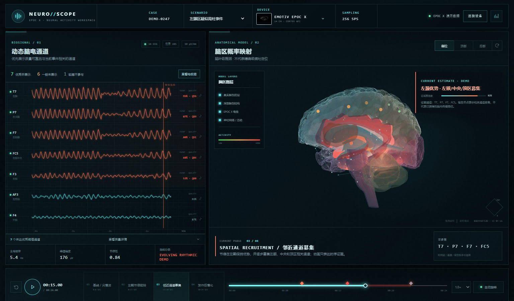

# NeuroScope EEG Dashboard

NeuroScope 是一个可直接运行和部署的多设备 EEG 研究可视化 Demo。它把动态通道质量、合成左颞癫痫样事件、证据通道、24 结构解剖脑和多维验证框架放在同一个时间轴中。

> Research visualization demo only. Not a medical device. Do not use it for diagnosis or treatment decisions.



## 功能

- EMOTIV EPOC X、EMOTIV Flex 2、Muse 2、OpenBCI Cyton、Ganglion 和通用 10–20 Profile；
- 左侧只展示连接质量达到优秀阈值的通道，其余通道保留在可展开列表；
- 24 秒合成病例：基线/尖慢波、左颞节律起始、邻近通道募集、发作后慢化；
- BodyParts3D 派生的 24 结构 GLB，包括脑叶、边缘系统、深部核团、小脑和脑干；
- Three.js 半透明材质、内部网络节点、局灶光晕、传播弧线、设备电极和可旋转视角；
- Cortex API 与通用 WebSocket Bridge 接入骨架；
- 硬件、数据质量、算法、脑区映射、人因、安全和工作流验证框架。

## 本地运行

### Windows，无需安装 Node.js

双击 `run_dashboard.cmd`。脚本会启动本地服务并打开：

```text
http://127.0.0.1:4173/
```

### Node.js 20+

```bash
npm run dev
```

打开 `http://127.0.0.1:4173/`。

常用演示入口：

```text
/?scenario=temporal&time=15
/?scenario=quality&time=10
/?scenario=normal&time=5
/?device=emotiv-flex-2
/?validation=1
```

## 验证与构建

```bash
npm run check
npm run build
npm run verify
```

生产静态文件生成在 `dist/`。`.github/workflows/pages.yml` 可以在 `main` 分支更新后构建并部署 GitHub Pages；需要在仓库 Settings → Pages 中把 Source 设为 GitHub Actions。工作流使用 GitHub 官方当前 Pages Actions 组合。

## 项目结构

```text
.
├── index.html                     页面结构与 Three.js import map
├── styles.css                     仪表盘视觉和响应式布局
├── app.js                         EEG、设备、时间轴和界面状态
├── brain-renderer.js              24 结构解剖脑和活动动画
├── device-profiles.js             多设备 Profile 与 montage
├── validation-framework.js        验证维度、Metric 和 Gate
├── cortex-client.js               EMOTIV Cortex 接入
├── generic-device-client.js       通用设备 Bridge 接入
├── assets/anatomy/                GLB 及其 CC BY-SA 许可
├── assets/devices/                设备图片及来源
├── docs/                          验证和设备适配文档
├── scripts/                       开发服务器与静态构建
└── .github/workflows/pages.yml    GitHub Pages 发布
```

## 数据与医学边界

- 当前 EEG 与癫痫样事件全部是确定性的合成数据，不含真实患者数据；
- 暖色脑区表示演示性的时序证据范围，不表示已经测得脑内传播路径；
- 头皮 EEG 不能唯一反演精确致痫灶，界面只允许表达脑叶级模型推测；
- 接入真实设备时，当前版本只显示原始 EEG 和质量状态，不冒充已验证的诊断算法；
- 数据质量不足时必须拒绝强脑区输出。

## 许可

应用代码使用 MIT License。`brain-renderer.js` 包含对 NeuroTrace EEG Digital Twin 渲染方式的 MIT-licensed 改编，详见 `THIRD_PARTY_NOTICES.md`。

`assets/anatomy/brain-anatomy.glb` 派生自 BodyParts3D，使用 CC BY-SA 2.1 Japan；模型再分发和修改必须保留署名并遵守相同许可，详见 `assets/anatomy/LICENSE.md`。
